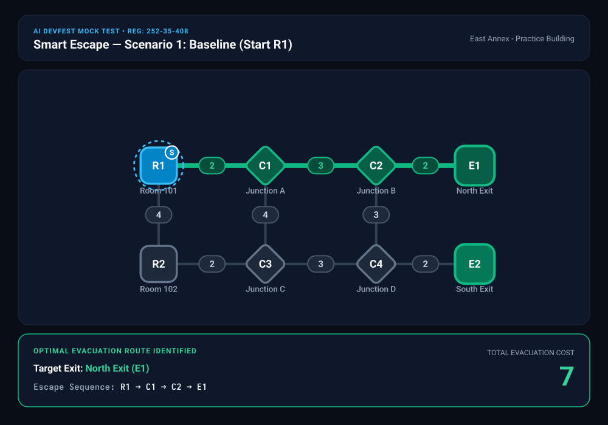
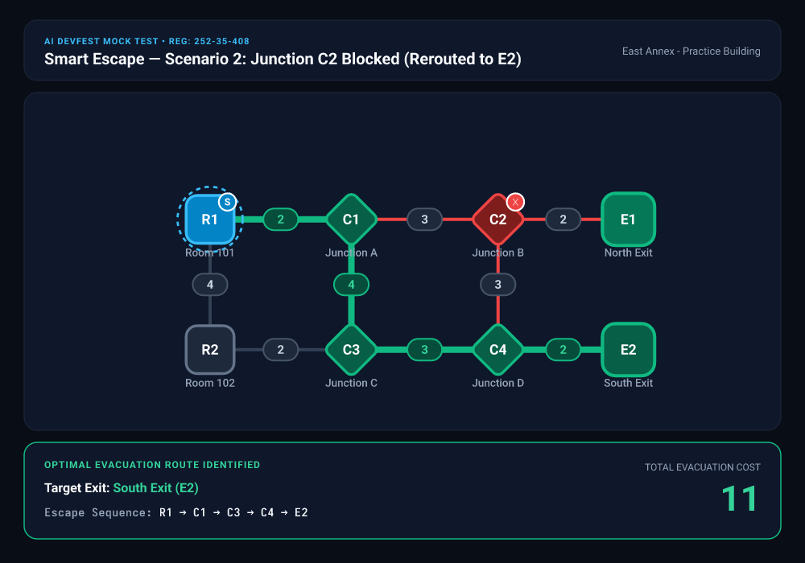

# Smart Escape — Interactive Evacuation Route Simulator
**AI DevFest Mock Test Solution**



---

## 1. Participant Identity
- **Full Name:** Mahtabul Al Nahian
- **Registration Number:** `252-35-408`
- **GitHub Repository:** [https://github.com/DJRCX/devfest-252-35-408](https://github.com/DJRCX/devfest-252-35-408)
- **Live Deployment (Vercel):** [https://devfest-252-35-408.vercel.app](https://devfest-252-35-408.vercel.app)
- **Live Deployment (GitHub Pages):** [https://djrcx.github.io/devfest-252-35-408/](https://djrcx.github.io/devfest-252-35-408/)

---

## 2. Project Overview
Smart Escape is a client-side evacuation route simulator designed to find the lowest-cost escape route from any designated room or junction to an accessible emergency exit. When simulated hazards emerge (blocked rooms, obstructed corridors, or closed exits), the application recalculates the safest alternative route in real time.

---

## 3. Screenshots

### Baseline Route (Scenario 1)
Start: `R1` → Route: `R1 - C1 - C2 - E1` | **Cost: 7** | Exit: `E1 (North Exit)`


### Rerouted Route after Blocking Junction C2 (Scenario 2)
Start: `R1` (with `C2` blocked) → Route: `R1 - C1 - C3 - C4 - E2` | **Cost: 11** | Exit: `E2 (South Exit)`


---

## 4. Running Instructions

### Prerequisites
- Node.js `v18.0.0` or higher (tested on `v26.10.0`)
- npm `v9.0.0` or higher (tested on `v12.2.0`)

### Installation
Clone the repository and install dependencies:
```bash
git clone https://github.com/DJRCX/devfest-252-35-408.git
cd devfest-252-35-408
npm install
```

### Running the Development Server
```bash
npm run dev
```
Open [http://localhost:3000](http://localhost:3000) in your browser.

### Running Automated Tests
The comprehensive Vitest test suite covers input validation, Dijkstra routing, tie-breaking rules, and all Section 4.1 mock test cases:
```bash
npm test
```

### Production Build & Static Export
```bash
npm run build
```
Creates an optimized static export in the `out/` directory, ready to serve from any static host or CDN.

---

## 5. Implemented Features

### Core Requirements
- **Import & Schema Validation:** Validates JSON input according to Section 3.1 rules (2–60 nodes, 1–150 edges, unique IDs, non-empty labels, valid types, positive integer costs, no self-loops or duplicate undirected edges, and valid initial-state categories). Disconnected graphs are supported.
- **Interactive SVG Building Map:** Renders rooms, junctions, exits, and corridors according to supplied $(x, y)$ coordinates with visible labels, distinct shapes, and corridor costs.
- **Dijkstra Lowest-Cost Routing:** Computes true path cost as the sum of edge weights. Never substitutes display coordinates or hop counts for weight.
- **Exact Tie-Breaking:**
  1. Chooses the reachable open exit with minimum cost.
  2. On equal cost, chooses the lexicographically smallest exit ID (`a.id < b.id`).
  3. If multiple paths to that exit tie in cost, chooses the lexicographically smallest sequence of node IDs.
- **Dynamic Simulated Hazards:**
  - Block/unblock rooms or junctions (and automatically disconnect incident edges).
  - Block/unblock corridors individually.
  - Close/reopen exits (closed exits cannot be used as destinations or traversed as intermediate nodes).
- **Immediate Recalculation:** Instant updates upon any start selection or hazard toggle, without re-importing.
- **State Reset:** Restores the building's original `initial_state`.
- **Failure Condition Handling:**
  - Clearly reports **"Starting location blocked"** when the start node is hazard-blocked.
  - Clearly reports **"No route available"** when no exit is reachable.
- **Two Language Modes:** Full toggle between English and Bangla (বাংলা) for all principal UI elements, buttons, statuses, errors, and instructions.

### Bonus / Extension Features
- **Section 4.1 Quick Scenarios:** One-click buttons to instantly test all 5 official sample scenarios.
- **Export Map as PNG:** High-resolution map export with status overlay for documentation and reports.
- **High-Contrast Mode:** Enhanced accessibility toggle for map elements.
- **Animated Route Dash:** Smooth SVG dashoffset animation highlighting the active escape trajectory.

---

## 6. Known Issues
- None. All 16 automated tests pass, and zero build warnings are emitted.

---

## 7. AI Tools & Most Useful Prompt
- **AI Tool Used:** Antigravity AI Assistant
- **Most Useful AI Prompt:**
  > *"Implement Dijkstra's shortest path algorithm with exact tie-breaking: on equal total cost choose the lexicographically smallest exit ID, and on equal path costs to that exit choose the lexicographically smallest sequence of node IDs. Exclude blocked nodes, blocked edges, and closed exits (both as destinations and intermediate transit points). Immediately re-calculate without re-importing when hazards change."*

---

## 8. License
This project is licensed under the MIT License — see the [LICENSE](./LICENSE) file for details.
